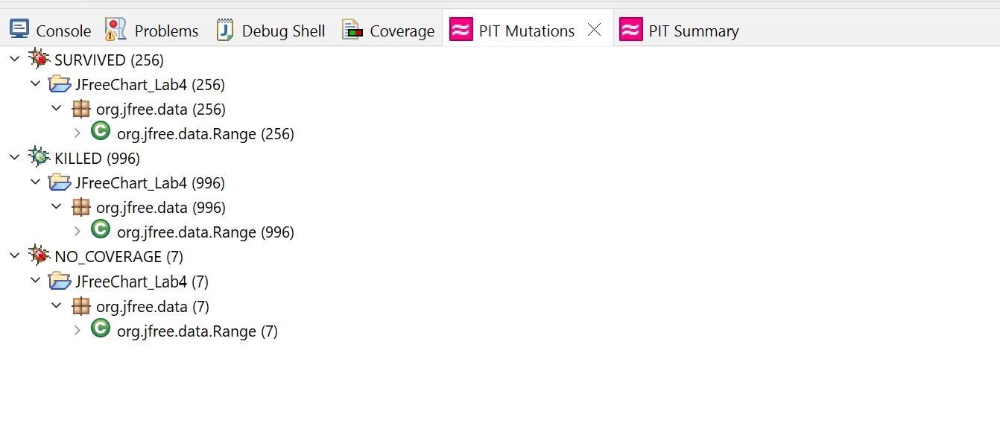

**SENG 637 - Dependability and Reliability of Software Systems**

**Lab. Report \#4 – Mutation Testing and Web app testing**

| Group: 16           |
|-------------------------------|
| Sayan                     |   
| Md Afif Al               |   
| Sutirtha                   |   
| Abhijit              |
| Moshfiq-Us-Saleheen  |

# Introduction

In this laboratory exercise, we split our focus into two main parts: 
1. Mutation testing
2. GUI testing

### Mutation testing
As per the requirements, we concentrated on the `Range` and `DataUtilities` classes. Using tools like Eclipse, JUnit, and Pitest, we brought over the tests we developed earlier in the Assignment 3. With these tools, we introduced changes, known as mutants, into the code to see how well our tests could identify these alterations. Our main target was to enhance our tests to detect more of these mutants, ideally increasing our mutation score by at least 10%.

### GUI testing
The second part of our exercise involved GUI testing with the Selenium IDE. 
At first, we selected a website from the provided options. Then we devised a test plan and followed along. This lab report is compiled with descriptive analysis for both type of testing.

# Analysis of 10 Mutants of the Range class 

We picked 10 different types of mutants of the Range class for this analysis. We focused on covering as many different types as we can from different functions from the class.

### Mutation 1 (Line 110, Mutation 7)
#### Mutation Applied: Decremented (--a) double fieldlower → KILLED

Target Method: `public double getLowerBound()`
```
return this.lower
```
The mutation is applied in the above line and it suggests that the lower value is decremented by 1 before returning. So, for a Range(-1, 2), the method would return `-1 - 1 = -2`. However, our test suite perfectly handles the issue as it is obvious that we would assert equal to -1 for getLowerBound() call. Hence, this mutation was killed. 
```
return this.lower - 1
```
For example, a Range with (-5, 5) and a value -5, the method would return false even though it is in the same range. However, our test suite is successfull to assert such issues hence the mutation was killed.

### Mutation 2 (Line 147, Mutation 40)
#### Mutation Applied: Incremented (a++) double field lower → SURVIVED

Target Method: `public double getCentralValue()`
```java
return this.lower / 2.0 + this.upper / 2.0;
```
The mutation is applied in the above line and it suggests that the lower value is post-incremented by 1. The resultant line would look like this:
```java
return this.lower++ / 2.0 + this.upper / 2.0;
```
However, as it is a post-increment and the increment operation only happens after the whole line is executed there is no change in the result and the mutation survives. We can evaluate this issue with a simple print statement:
```java
int a = 2;
System.out.print(a); // 2
System.out.print(a++); // Still a 2
```

### Mutation 3 (Line 159, Mutation 1)
#### Mutation Applied: changed conditional boundary → KILLED

Target Method: `public boolean contains(double value)`
```java
if (value < this.lower) {...}
```
The mutation suggests that a change has been made in the comparison operation from "less than" to "less than or equal" in the code snippet provided within the contains method. So the above line became:
```java
if (value <= this.lower) {...}
```
For example, a Range with (-5, 5) and a value -5, the method would return false even though it is in the same range. However, our test suite is successfull to assert such issues hence the mutation was killed.


### Mutation 4 (Line 198, Mutation 1)
#### Mutation Applied: replaced boolean return with false for org/jfree/data/Range::intersects → KILLED

Target Method: `public boolean intersects(Range range)`
```java
return intersects(range.getLowerBound(), range.getUpperBound());
```
This mutation is essentially replacing the boolean method call with a `false`.
```java
return false
```
For example, event though a base Range with (-5, 5) would intersect with a Range(5, 10) the method would still return `false`. However, it is straightforward that our test case expects a `true` in such cases and this mutation was killed.

### Mutation 5 (Line 239, Mutation 1)
#### Mutation Applied: negated conditional → KILLED

Target Method: `public static Range combine(Range range1, Range range2)`
```java
if (range1 == null)
  return range2;
```
This mutation is negating the conditional value. In simpler words, the condition will now be changed to the cases when the object is not null.
```java
if (range1 != null)
  return range2;
```
With this mutated condition, even when the range1 is not null, the method would blindly return range2. Howeever, in our test cases we expect range2 to be returned only when range1 is null which would fail the test case and kill this mutant.

### Mutation 6 (Line 240, Mutation 1)
#### Mutation Applied: replaced return value with null for org/jfree/data/Range::combine → KILLED

Target Method: `public static Range combine(Range range1, Range range2)`
```java
return range2;
```
This mutation would return a null on combine method call regardless the scenario essentially turning the return statement like below.
```java
return null;
```
With this mutated condition, the method would return null on every call regardless of the input parameters. But our test methods like `testCombineWithFirstRangeNull` would expect the method to return the second range when the first range is null. This would fail the test case as well as killing the mutation.

### Mutation 7 (Line 351, Mutation 1)
#### Mutation Applied: removed call to org/jfree/chart/util/ParamChecks::nullNotPermitted → SURVIVED

Target Method: `public static Range expand(Range range, double lowerMargin, double upperMargin)`

```java
ParamChecks.nullNotPermitted(range, "range");
```
This mutation removes the call to the above line or simply ignores it. The method call throws IllegalArgumentException if the parameter range is null. Since there was no test case that tests base as null for this method, the removal of the call to ParamChecks.nullNotPermitted() went unnoticed by the tests and the mutation was survived.

### Mutation 8 (Line 409, Mutation 2)
#### Mutation Applied: Substituted 0.0 with 1.0 → KILLED

Target Method: `private static double shiftWithNoZeroCrossing(double value, double delta)`
```java
if (value > 0.0) {
```
This mutation would change the above condition the following one:
```java
if (value > 1.0) {
```
With this mutation, the condition would be true only if the value is greater than 1.0. However, our test cases include such scenario where changing it to 1.0 fails the test case. Hence, it kills the mutation.

### Mutation 9 (Line 448, Mutation 3)
#### Mutation Applied: removed conditional - replaced equality check with true → KILLED

Target Method: `public boolean equals(Object obj)`
```java
if (!(obj instanceof Range)) {
    return false;
}
```
In the base condition, we are checking if the passed down object is an instance of Range. If not, we are returning false. However, the mutation changes the condition to the following:
```java
if (true) {
  return false;
}
```
The condition with this condition is always true and returns false. Even in case when both of the ranges are same (for example, the test case `testEqualsWithIdenticalRanges`) the method would return false which clearly fails the test case killing this mutation.

### Mutation 10 (Line 485, Mutation 22)
#### Mutation Applied: Substituted 29 with 1 → SURVIVED

Target Method: `public int hashCode()`
```java
result = 29 * result + (int) (temp ^ (temp >>> 32));
```
In the base condition, we are performing arithmetic operations with specific constants like 29 and 32. Now, if we change the constants, the result would also change. For example, if we replace 29 with 1, the equation becomes:
```java
result = 1 * result + (int) (temp ^ (temp >>> 32));
```
The condition now would return a different result. However, our current test cases somehow overlooked this scenario and the mutation survives.


# Statistics and the mutation score for each test class
We had 2 test failures for Range class in assignment 3. As PIT doesn't allow us to run with fail cases, we removed them before testing the scores of our assignment 3. We first generated the statistics for the test classes from assignment 3 and then we updated the source codes for Range and DataUtilities as well as added test cases to improve mutation coverage. We provide a descriptive statistics for our test cases below.
## Mutation Statistics - Before
#### Range Class
**PIT Mutation**


**Pit Test Coverage Report**


#### DataUtilities Class
**PIT Mutation**


**Pit Test Coverage Report**


## Mutation Statistics - After
#### Range Class
**PIT Mutation**



**Pit Test Coverage Report**


#### DataUtilities Class
**PIT Mutation**


**Pit Test Coverage Report**


We added all these reports in the [mutation_tests](mutation_tests/) directory for a better observation.

# Analysis on the effectiveness of each of the test classes

In this section, we provide a comparative analysis of the effectiveness of both `Range` and `DataUtilities` test classes for Assignment 3 and 4:

### DataUtilities.java

| |Before (Assignment 3)|After (Assignment 4)|Improvement|
|-|------|-------|---------|
|Line Coverage|89%|99%|10%|
|Mutation Coverage|78%|92%|14%|
|Test Strength|86%|92%|6%|

The `DataUtilities` class already had a good line and mutation coverage from assignment 3. The table provided above clearly illustrates that upon integrating the source codes for Assignment 4 and adding some test cases we were able to achieve line coverage of 99% which is of 10% more than the previous one. We also experienced an improvement of 14% for mutation coverage. We believe it will be really challenging to introduce any more improvement. The rationale behind this is that from the PIT Mutation we have only 54 survived mutants compared to 607 killed ones

### Range.java
| |Before (Assignment 3)|After (Assignment 4)|Improvement|
|-|------|-------|---------|
|Line Coverage|89%|100%|11%|
|Mutation Coverage|67%|79%|12%|
|Test Strength|72%|80%|8%|

Even though, the `Range` class had the same line coverage, the mutation coverage was comparatively low compared to `DataUtilities` class. Our investigation says the coverage mostly got hurt in methods that we did not cover in the last assignment. Hence, in this assignment we addressed some of those methods and also some cases that were not covered. For example, introducing tests for `hashCode()` method alone introduced around 5% improvements. We also noticed that mutation coverage could be further improved if we ignore some equivalent mutants. For example, most of the survived mutants are post-increment or decrement return statements, where the value of the statement only changes after the method has returned. Effectively, it does not make any change in the output however, the mutant survives.

# Effect of equivalent mutants on mutation score accuracy
### Effect of equivalent mutants
 In mutation testing, equivalent mutants refer to mutated versions of the code that exhibit the same behavior as the original code. Essentially, these mutants don't change the behavior of the program under test, meaning they remain undetected by the test suite. Hence, equivalent mutations do not necessarily simulate defects in the SUT and therefore cannot be eliminated by test cases.

We encountered equivalent mutants in our analysis, specifically the post-increment and post-decrement mutants injected into all methods as we described in the previous section. Despite various attempts, we struggled to eliminate most of them. This difficulty remain because these equivalent mutations were introduced within the return statement of the methods, where altering the variable's value after its utilization would not impact the return value. For example, let's notice the figure provided below:

It is clear that most of the survived bugs are either decrements or increments. There also exists some variations like incrementing by 1 or 3 or some other numeric value which essentially doesn't exhibit any change to the behavior but hurts the score accuracy as it is calculated by the proportion of killed mutants and total mutants.

### How to detect equivalents mutants?
During this assignment, we researched on detecting equivalents mutants. However, we did not find much solid resources or any established frameworks to do so. So, we devised our own approach to detect equivalent mutants. Although manual, we believe this approach is pretty effective.

1. **Semantic Analysis**: Rather than blindly depending on Pitest or any such testing framework, evaluate whether the mutated code alters the behavior of the program by conducting a semantic analysis.

2. **Mutation Score**: Monitor the mutation score, where a low ratio of killed mutants to total mutants may indicate the presence (similar to our case) of equivalent mutants.

3. **Manual Inspection**: Review mutated code alongside the original to identify mutations that do not affect program behavior, employing manual inspection as a strategy.

# Improving the mutation score of the test suites
In this assingment, we worked on mutation testing of `Range` and `DataUtilities` classes. However, as indicated in other preceeding sections, we do not have a 100% mutation coverage. Although, it is impractical to expect a 100% coverage for mutation testing and it is also challengine to improve mutation coverage, we believe there is still room for improvements. For example, our current alaysis says, most of the durvived mutants are equivakents -
- Approximately 115 equivalent mutants just of a++ and a-- out of 256 (47%) survivors in the Range class. 

- Approximately 31 equivalent mutants just of a++ and a-- out of 54 (57%) survivors in the DataUtilities class. 

The other surviving mutants are also of similar types like substituting a number with another number or post decrement. We conducted a thorough study on how to mitigate this issue. Unfortunately, there is not much to do as it takes a lot of time and effort in handpicking and removing equivalent mutants. Therefore, we can only report the steps we have taken to improve mutation scores of Assignment 3.

1. Design test cases specifically to target mutations. This involves anticipating common mutation types (e.g., changing arithmetic operators, swapping conditionals) and crafting tests to detect these changes.
2. Perform static code analysis to identify areas of the code that are prone to errors or are difficult to test. This can guide you in writing more effective test cases targeting these areas.
3. Regularly analyze mutation testing reports to identify patterns, weaknesses in test coverage, and areas for improvement. Use these insights to iteratively enhance your test suite. For example, we identified the equivalent mutants and they should not contribute to the mutation coverage.

# Why do we need mutation testing? Advantages and disadvantages of mutation testing

Mutation testing is a way to check how good your tests are. Imagine you have a set of tests for your program. Mutation testing involves making small changes (mutations) to your program's code on purpose to create slightly wrong versions of it. Then, it runs your tests against these wrong versions. The idea is if your tests are good, they should fail because they've caught the mistakes. If the tests don't fail, it might mean they are not checking thoroughly enough.

### Advantages of Mutation Testing:

1. **Improves test quality**: Mutation testing is highly effective in detecting faults or weaknesses in test suites. By introducing small changes to the code, it evaluates the capability of the test suite to detect these alterations, thereby revealing potential vulnerabilities in the codebase.

2. **Finds hidden bugs**: Sometimes, it can catch mistakes or loop holes in the code that were overlooked before because it forces the tests to look at the code in new ways.

3. **Better code understanding**: Mutation testing provides valuable feedback on the quality and effectiveness of test cases. It guides developers in identifying gaps in test coverage and encourages them to create additional test cases targeting specific areas of the codebase.

### Disadvantages of Mutation Testing:

1. **Time and resource complexity**: Mutation testing can be very slow because it has to create a lot of wrong versions of your program and then test each one. This can take a lot longer than regular testing

2. **False positives and negatives**: Mutation testing may produce false positives (indicating a test failure when the code is actually correct) or false negatives (failing to detect faults present in the code). These inaccuracies can lead to different confusions during development slowing down the progress and reliability of the testing.

3. **Equivalent mutants**: From our experience with the assignment, this is probably the most challenging problem with mutants. While they degrade the score, they do not introduce any advantage to the testing process. Also, they are really hard to deal with.

# Selenium test case design process
Prior to initiating testing procedures, we conducted a thorough examination of the provided websites. We explored different functionalities of these websites. With a careful observation and exploration, we choose [Shop Smart Canada](https://shopsmartcanada.com/) as our System Under Test (SUT). Our rationale for selecting this particular website is as follows:

1. By the look of the website, we could tell it is an old website having potential existence of bugs making it a perfect test subject.
2. The website is built using PHP and follows a multi-page structure which makes it easier to imitate user interactions.
3. Additionally, we observed that other websites like [Home Depot](https://www.homedepot.ca/) dynamically generate DOM element IDs, rendering it more challenging to intercept the desired targets using Selenium.

With the SUT chosen, we compiled a list of functionalities to be tested or automated using Selenium IDE. Our emphasis was on the most frequently used features of the website. The outlined features are as follows:

- Login
- Searching with different queries
- Add or remove addresses
- Sorting products with different criteria
- Updating account information
- Adding or removing items from cart
- Creating and deleting wish list
- Adding or removing items from wish list
- Newsletter subscription

After defining the scenarios or functionalities, we created several test cases for each of the functionalities to be tested and analyze if they work as expected. For example, we expect a user can login with valid credentials but can not with an invalid one.

As the website requires authentication for different actions to be performed, we also created a test account with the following credentials and used it as required:
```
Email: vzz3wv0uf4@lettershield.com
Password: testPassword123
```
# Explain the use of assertions and checkpoints
In Selenium, assertions and checkpoints are essential for validating the behavior and the state of web elements or pages during test execution. We assert in different checkpoints to make sure everything is working as expected.

**Assertions:**
Assertions are statements that verify whether a certain condition is true or false. For example, we might assert that a certain element is present, has a specific text, or is enabled/disabled. If the assertion fails during test execution, it indicates a discrepancy between the expected and actual behavior. Quoting the Selenium documentation, there are 3 types of assertions.

>  **Assert:** If it fails, the test is stopped immediately.<br> **Verify:** If it fails, Selenium IDE logs this failure and continues with the test execution.<br>**WaitFor:** waitFor commands will first wait for a certain condition to become true.

In our testing, we used all of the assertion types.

**Checkpoints:**
Checkpoints are similar to assertions but often they are used to ensure that specific criteria are met at a particular point during test execution. For instance, you might use a checkpoint to verify the contents of a table, the presence of multiple elements on a page, or the state of a dynamic user interface component. If any of the checkpoint conditions are not met, the test execution may fail, indicating a deviation from the expected behavior.

A few examples are provided below from our generated test cases:

|Test functionality|Example of checkpoints|
|---------|----------------------|
|Login_Valid_Credentials|Asserts to the change in the header upon login or the alert message on incorrect credentials.|
|Login_Invalid_Credentials|Asserts to the alert message on incorrect credentials.|
|Account_Settings_Update_Phone_Number_Valid|Asserts text to verify if the setting is actually updated.|
|Account_Settings_Update_Phone_Number_Invalid|Asserts text to verify if the setting is actually updated.|
|Address_Valid_Data|Asserts to the new address title.|
|Address_Invalid_Data|Verifies the behaviour of the SUT whether it updates with invalid data or not.|
|Search_With_Valid_Query|Verifies the content on the page on valid search query|
|Search_With_Valid_Query|Asserts to "0 results for {query}" on invalid query.|
|Cart_Add_Item|Asserts to "Your Cart" when adding an item.|
|Cart_Remove_Item|Verifies to the text label "Your cart is empty" when everything is deleted from cart.|
|Newsletter_Subscribe_Valid|Upon subscription, asserts the confirmation text.|
|Newsletter_Subscribe_Invalid|Upon subscription attempt, asserts the error message.|
|Wish_List_Create_New_List|Asserts to list name when creation.|
|Wish_List_Delete_All_List|Asserts to text "You have no Wish Lists, add one now." when deleting all lists.| 
|Wish_List_Add_Item|Asserts to list name and waits for the added item to show up in the list.|
|Wish_List_Remove_Item|On item removal, also verifies the text - "Your Wish List is empty. When you add items to your Wish List they will appear here."|

Almost all functionalities under test also uses logout on which the test asserts or verifies to the text "You've been logged out of your account successfully."
# Testing functionality with different data
In total, we considered 9 features with 20 different inputs or test data. Whenever possible, or the test case allowed, we tested each test cases with different data. Our test cases also managed to find some existing bugs in the system. A brief table is provided with the different types of test data used.

|Test case|Test data/command|Expected|Actual|Decision|
|---------|---------|--------|------|--------|
|Login|Tested with valid credentials|Should log in|Logged in|Pass|
||Tested with invalid credentials|Should not log in and an error alert should be shown|Did not log in and an alert was shown|Pass|
|Account Settings - Update Phone Number|Valid phone number|Should update the number|Updated the number|Pass|
||Invalid phone number|Should not update the number|Updated the number|**Bug detected**|
|Search|Valid query item|Should show a list of items matching the query|Shows a list of query items|Pass|
||Invalid query item|Should not show any item but a zero response|Does not show any item but "(0) results"|Pass|
|Address - Add New Address|A valid Alberta address is provided|Should add the address|Added the address|Pass|
||An invalid address is provided|Should not add the address rather show an error message|Added the address|**Bug detected**|
|Cart|Add item to the cart|Should add the item to the cart|Added the item to the cart|Pass|
||Remove item from the cart|Should remove the item to the cart|Removed the item to the cart|Pass|
|Wish List - Creation/Deletion|Provide a wish list name to create|Should create a new wish list by the provided name|Creates the wish list|Pass|
||Remove an existing wish list|Should remove the wish list by the provided name|Removes the wish list|Pass|
|Wish List - Add/Remove Item|Add an item to a wish list|Should add the item to the wish list|Adds the item to the list|Pass|
||Remove an existing item from wish list|Should remove the item from the list|Removes the item from the list|Pass|
|Sort|Use alphabetical sorting|Should sort the items alphabetically|Sorts the item alphabetically|Pass|
||Use price-based sorting|Should sort the items by their price|Sorts the item by price|Pass|
||Use best-selling sorting|Should sort the items based on best selling|Sorts the item as expected|Pass|
||Use review-based sorting|Should sort the items based on reviews|No change is reflected in UI|**Bug detected**|
|Newsletter - Subscription|Use a valid email to subscribe|A confirmation message should be shown|Shows a confirmation message|Pass|
||Use an invalid email to subscribe|An error message should be shown|Shows an error message|Pass|

Although not expected but we were able to find a few bugs in the system. Additionally, we also believe the website is lacking some crucial features. For example, the website only provides an interface to subscribe to their newsletter but doesn't provide an option to unsubscribe.

# How the team work/effort was divided and managed

Let's delve into how the team's work and effort were managed and divided, focusing particularly on the mutation testing and Selenium testing within the context of the Range and DataUtilities classes.

#### Division of Work and Management

The team initially divided the tasks into two main categories: mutation testing and Selenium testing. This approach ensured that all team members would gain experience with different types of testing techniques, which are crucial in software testing and quality assurance.

**Mutation Testing:**
- The team was split into two groups. One group focused on the `Range` class, while the other group worked on the `DataUtilities` class. This division allowed members to specialize and worked into specific areas, which likely improved the quality of the testing and analysis.

The work distribution is as following:

|Task|Members|
|----|-------|
|Improvement of mutation coverage of DataUtilities class| Afif, Sayan|
|Improvement of mutation coverage of Range class| Abhi, Sutirtha, Moshfiq|
|Analysis of mutations|Team collaboration|


**Selenium Testing:**
- Selenium testing was assigned to be done independently by each team member. Each team member was assigned with specific features. 

The work distribution is as follows:
|Feature|Member|
|------|------|
|Login functionality|Afif|
|Account settings update|Sayan|
|Searching for items|Abhi|
|Address update|Sutirtha|
|Cart operations|Afif|
|Wish List - creation/deletion|Moshfiq|
|Wish List - Add/remove item|Sayan|
|Sorting items in the product page|Sutirtha, Moshfiq|
|Newsletter subscription|Abhi|

#### Compilation of the Report
- The final step involved pulling together the findings from both mutation and Selenium testing into a comprehensive report. This required effective communication and collaboration as each member contributed their insights and results.
- We had several online and offline collaborations to compile this report.

# Difficulties encountered, challenges overcome, and lessons learned

### Difficulties and Challenges:

**1. Mutation Testing Setup:** Encountered initial challenges in configuring the mutation testing environment correctly.

**2. Understanding PIT Reports:** Struggled to interpret mutations and navigate through the detailed PIT reports effectively.

**3. Analyzing Equivalent Mutants:** Faced difficulties in identifying and analyzing equivalent mutants due to their complex nature.

4. **Discepencies in JDK version:** The mutation test was not running due to mismatch in JDK version. Spent few hours to debug this problem. 

### Lessons Learned:

In this assignment 4, the team learned the crucial importance of proper setup and preparation. A well-configured environment lays the foundation for any successful testing process. The experience also underscored the value of patience and dedication to understanding complex testing reports and tools, like PIT. Finally, the challenge of dealing with equivalent mutants taught the team the significance of prioritization and strategic analysis in software testing. Through these experiences, the team gained a deeper appreciation for the intricacies of mutation testing and the meticulous attention to detail required for effective software quality assurance.

# Comments/feedback on the assignment itself

The assignment was a hands-on learning experience that allowed us to dive deep into mutation testing and Selenium testing. The practical approach helped us understand the complexities of software testing better.

One positive aspect was the division of tasks between mutation and Selenium testing, which ensured that all team members got a well-rounded experience. However, more guidance on interpreting PIT reports and identifying equivalent mutants would have been beneficial.

The assignment was challenging but rewarding. It pushed us to apply theoretical knowledge in real-world scenarios. However, clearer instructions and examples, especially for setting up testing environments, would have made the learning curve less steep.

Overall, the assignment was a valuable learning tool, but could be improved with more support materials and clearer guidelines.
